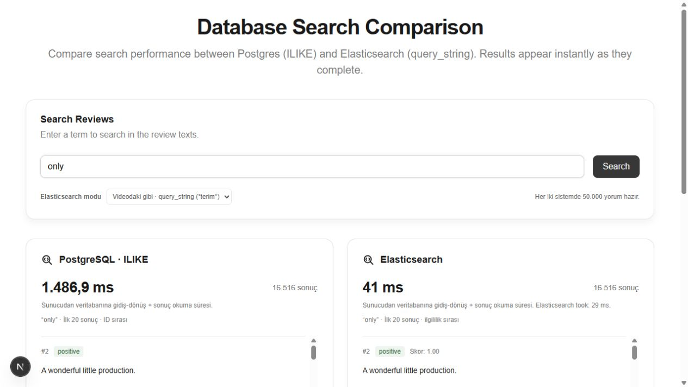
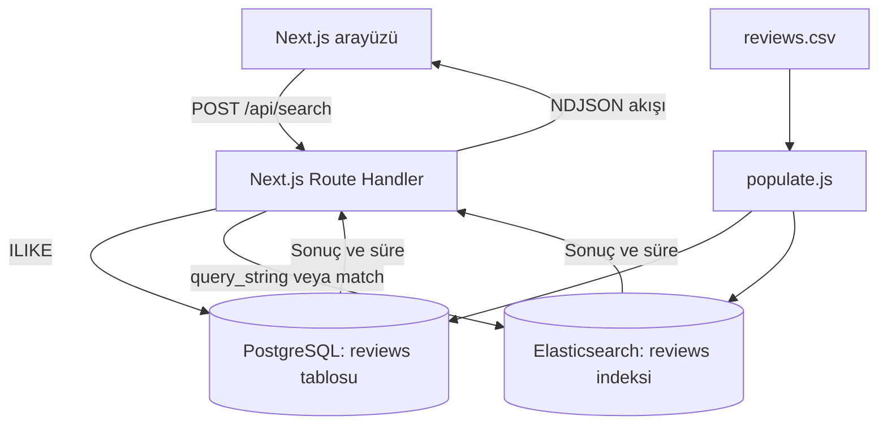

# PostgreSQL vs Elasticsearch — Search Demo

Videodaki Next.js demosunun yeniden uygulaması. PostgreSQL `ILIKE` ve Elasticsearch `query_string` aynı CSV üzerinde eşzamanlı çalışır. API sonuçları NDJSON akışıyla tamamlandıkları anda ayrı ayrı gönderir.

**Next.js · TypeScript · PostgreSQL · Elasticsearch · Docker Compose**

Bir öğrenme projesi: aynı veri üzerinde alt metin ve tam metin aramasının sürelerini, sonuç sayılarını ve eşleşme farklarını gözlemleyin.



İlham alınan video: [Full text search using Elasticsearch — demo bölümü](https://www.youtube.com/watch?v=7_sovzAhRSM&t=1324s). Bu repo bağımsız yeniden uygulamadır; videonun orijinal kaynak kodu değildir.

## Özellikler

- Aynı 50.000 yorum üzerinde iki eşzamanlı arama.
- PostgreSQL `ILIKE`, Elasticsearch `query_string` ve ek `match / AND` modu.
- Hazır olan sonucu diğer motoru beklemeden gösteren NDJSON akışı.
- Toplam eşleşme, ilk 20 yorum, duygu etiketi ve gerçek sorgu süreleri.
- Ayrı yükleniyor/hata durumları; yeni aramada önceki isteği iptal etme.
- Kalıcı Docker volume'ları ve isteğe bağlı Neon / Elastic Cloud desteği.

## Mimari



Next.js arayüzü ve API aynı uygulamada çalışır. Veritabanları ayrı Docker servisleridir. Arama sırasında CSV okunmaz; önceden yüklenmiş tablo ve indeks sorgulanır.

## Veri nerede tutulur?

| Konum | İçerik |
| --- | --- |
| `scripts/data/reviews.csv` | İndirilen ham veri; Git'e dahil edilmez |
| PostgreSQL `es_test` → `reviews` | `id`, `review`, `sentiment` alanları |
| Elasticsearch → `reviews` | Aynı ID ve yorumları içeren belgeler |
| Docker volume'ları | `es-test_postgres-data` ve `es-test_elasticsearch-data`; konteyner durdurulunca veriler kalır |

Kaynak: [IMDb 50K / Zenodo](https://zenodo.org/records/7929635), [orijinal Stanford çalışması](https://ai.stanford.edu/~amaas/data/sentiment/). İndirme script'i gerekirse GitHub aynasını kullanır ve MD5 değerini doğrular. Ayrıntılar: [veri kaynağı notları](scripts/data/README.md).

## Başlatma — Windows / PowerShell

Node.js 22+ ve çalışan Docker Desktop (Linux containers) gerekir. Elasticsearch yaklaşık 1–2 GB RAM kullanabilir. Repoyu klonlayıp proje klasörüne geçin. Bu çalışmanın yerel kurulumu `C:\es-test` içindedir; başka klasörlerde de çalışır.

Windows'ta kısıtlı oturumların junction oluşturma sorununu önlemek için `dev` ve `build` komutları Next.js'in desteklenen `--webpack` seçeneğini kullanır.

```powershell
cd C:\es-test  # Veya repoyu klonladığınız klasör
npm.cmd ci
# .env.local yoksa:
Copy-Item .env.example .env.local
npm.cmd run setup
npm.cmd run dev
```

Tarayıcı: http://localhost:3000

`setup` PostgreSQL ve Elasticsearch konteynerlerini başlatır, 50.000 yorumu indirir ve iki sisteme yükler. Veri zaten yüklüyse yeniden populate çalıştırmak gerekmez. Sonraki açılışlarda:

```powershell
cd C:\es-test
npm.cmd run db:up
npm.cmd run dev
```

Konteynerleri veri kaybetmeden durdurmak: `npm.cmd run db:stop`.

macOS/Linux üzerinde `npm.cmd` yerine `npm`, ortam dosyasını kopyalamak için `cp .env.example .env.local` kullanılabilir. Bu proje Windows üzerinde doğrulanmıştır.

## Komutlar

| Komut | İşlev |
| --- | --- |
| `npm run dev` | Next.js arayüzü ve API: `127.0.0.1:3000` |
| `npm run db:up` | Docker servislerini başlatır, sağlık kontrollerini bekler |
| `npm run data:download` | CSV'yi indirir ve doğrular |
| `npm run populate` | Boş hedeflere aynı veriyi yükler |
| `npm run verify` | Veritabanı kayıtlarını ve gerçek aramaları kontrol eder |
| `npm test` | Birim testlerini çalıştırır |
| `npm run typecheck` | TypeScript kontrolü |
| `npm run build` | Üretim derlemesi |
| `npm start` | Derlenmiş uygulamayı başlatır; önce build gerekir |
| `npm run db:stop` | Veri silmeden servisleri durdurur |

Windows'ta `npm` yerine `npm.cmd` kullanılabilir.

## Klasör yapısı

```text
app/
  api/health/route.ts           # Bağlantı durumu ve kayıt sayıları
  api/search/route.ts           # Sorgular ve NDJSON akışı
  page.tsx                     # Arama formu
  layout.tsx
  loading.tsx
  globals.css
components/
  search-results-display.tsx   # Sonuç panelleri
  ui/search-icon.tsx
lib/
  clients.js                   # Veritabanı istemcileri
  neon.ts
  elasticsearch.ts
  search.js                    # Sorgular ve girdi doğrulama
  types.ts
  utils.ts
scripts/
  data/README.md
  create-table.sql
  download-data.js
  populate.js
  verify.js
tests/search.test.js
docs/search-comparison.jpg
docker-compose.yml
.env.example
```

## API

`POST /api/search` JSON gövdesi:

```json
{ "searchTerm": "only", "mode": "video" }
```

`mode`: `video` veya `fulltext`. Yanıt `application/x-ndjson`: her motor tamamlandığında ayrı bir JSON satırı gönderir; sıra sabit değildir. Alanlar: `engine`, `status`, `query`, `durationMs`; başarı durumunda `total`, `results`; Elasticsearch için ayrıca `engineTookMs`.

`GET /api/health`, iki taraftaki kayıt sayısını döndürür. `ready`, pozitif kayıt sayılarının eşitliğini gösterir; tüm belgelerin eşit olduğu garantisini vermez.

## Test et

- `movie`, `only`, `laptop` arayın; sonra aynı sorguyu birkaç kez tekrarlayın.
- `great movie` gibi birden fazla kelimeyi deneyin. Sonuç sayıları farklı olabilir.
- Elasticsearch modunu `Tam metin · match (AND)` yapıp kelime aramasını karşılaştırın.
- Bir servisi durdurduğunuzda diğer panel sonuç verebilir; hata ayrı gösterilir.

```powershell
npm.cmd test
npm.cmd run build
npm.cmd run verify
```

`verify` veritabanlarına bağlanarak kayıt sayılarını, üç örnek kaydın birebir eşitliğini ve gerçek aramaları kontrol eder.

## Örnek yerel ölçüm

5 Ekim 2026'da 50.000 yorumla yerel Docker ortamında `npm run verify` çalıştırılırken alınan **tek koşuya ait** sonuçlar:

| Sorgu | PostgreSQL eşleşme | Elasticsearch eşleşme | PostgreSQL süre | Elasticsearch süre |
| --- | ---: | ---: | ---: | ---: |
| `movie` | 32.461 | 32.461 | 1.442,6 ms | 155,2 ms |
| `only` | 16.516 | 16.516 | 1.383,4 ms | 51,8 ms |
| `laptop` | 33 | 33 | 1.499,6 ms | 41,5 ms |

Bunlar performans garantisi veya kontrollü benchmark değildir. Donanım ve önbellek durumu sabitlenmemiştir; `verify` motorları sıralı, web API'si eşzamanlı sorgular. Kendi ortamınızda tekrar ölçün. Çok kelimeli sorgularda sonuç kümeleri farklılaşır: bu kurulumda `great movie` için ILIKE 866, video modu 36.582, tam metin AND modu 7.903 eşleşme üretmiştir.

İlk kurulumda üretim derlemesi, üç birim testi, veritabanı doğrulaması ve tarayıcı üzerinden sonuç akışı kontrol edilmiştir.

## Videoyla aynı olanlar ve farklar

- `reviews`: `id`, `review`, `sentiment` alanları; 1.000 kayıtlık toplu yükleme.
- Elasticsearch `review:text`, `sentiment:keyword`; video modunda `*terim*` query_string.
- Next.js App Router, `app/api/search/route.ts`, `lib/neon.ts`, `lib/elasticsearch.ts`, `components/search-results-display.tsx`, `scripts/populate.js`.
- Videoda Neon ve Elastic Cloud kullanılıyor. Burada hesap açmadan denemek için yerel Docker varsayılan; bulut bağlantıları da destekleniyor.
- Veri kaynağı videoda belirtilmemiş. Aynı şemadaki 50K IMDb veri kümesi kullanılıyor; kaynak `scripts/data/README.md` içinde.
- Ağ yükünü sınırlamak için iki tarafta tüm eşleşmeler sayılır, ilk 20 yorum gösterilir. Videodaki sorgunun birebir performans sonucu hedeflenmez.
- Veri silme otomatik yapılmaz. `populate` dolu hedefte durur. Aynı CSV ile yarım kalan işlemi `npm.cmd run populate -- --resume` sürdürür; eşleşen ID'leri günceller. Farklı CSV için ayrı test veritabanı ve indeks kullanın.

## Sürelerin anlamı

Her paneldeki süre Next.js sunucusundan sorgunun gönderilmesi, bağlantı/yanıt ve sonuçların okunmasını içerir; tarayıcıya aktarım ve çizim süresini içermez. Elasticsearch `took` ayrıca yalnızca motorun raporladığı süredir ve PostgreSQL gidiş-dönüş süresiyle doğrudan kıyaslanmamalıdır. Başarısız veya kısmi sorgular başarı diye gösterilmez.

Bu karşılaştırma metin indeksi olmayan PostgreSQL ILIKE ile Elasticsearch arasındadır. PostgreSQL GIN/pg_trgm veya native full-text-search performansını ölçmez. ILIKE alt metin, query_string analiz edilmiş terimler arar: eşit sayıda sonuç garanti edilmez. Önbellek, ilk bağlantı, donanım ve ağ etkili olduğundan Elasticsearch'ün her sorguda hızlı çıkması beklenmemeli. Yerelde PostgreSQL de çok hızlı olabilir.

## Neon / Elastic Cloud

`.env.local` içinde:

```dotenv
DATABASE_DRIVER=neon
DATABASE_URL=postgresql://...Neon bağlantı adresiniz...
ELASTICSEARCH_URL=https://...Elastic Cloud endpoint...
ELASTICSEARCH_API_KEY=...API anahtarınız...
ELASTICSEARCH_INDEX=reviews
```

Yeni ve boş bir test veritabanı/indeksi seçin, `npm.cmd run data:download` ve `npm.cmd run populate` çalıştırın. `.env.local` dosyasını paylaşmayın veya Git'e eklemeyin. Neon HTTP sürücüsü yalnızca Neon için; normal PostgreSQL için `DATABASE_DRIVER=postgres` kullanılır. Kaynaklar: https://nextjs.org/docs/app/getting-started/installation ve https://www.elastic.co/docs/reference/query-languages/query-dsl/query-dsl-query-string-query

## Sorun giderme

- Docker named pipe/engine hatası: Docker Desktop açılmalı ve Linux motoru çalışmalı.
- Portlar: PostgreSQL `127.0.0.1:5433`, Elasticsearch `127.0.0.1:9201`, web `127.0.0.1:3000`. Mevcut varsayılan servislerle çakışmamak için DB portları farklıdır.
- Elasticsearch başlatılamıyorsa `docker compose logs elasticsearch` ile hatayı kontrol edin.
- Veri yüklendiği halde üst durum güncellenmediyse sayfayı yenileyin.
- CSV indirme hatası: kaynak sayfadan CSV'yi indirip `scripts/data/reviews.csv` içine koyun, `npm.cmd run populate` çalıştırın.
- `npm.ps1` execution policy hatası: komutları örneklerdeki gibi `npm.cmd` ile çalıştırın.
- Docker servisleri yalnızca localhost'a açıktır. Compose yapılandırması yerel geliştirme içindir.
